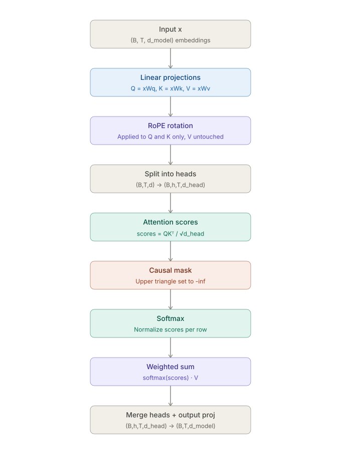

# transformer-from-scratch

A decoder-only, GPT-style transformer language model implemented from scratch in PyTorch (no `nn.Transformer`, no `nn.MultiheadAttention`) — trained CPU-only, extended with a RAG pipeline, and validated with a proper evaluation harness (perplexity, ablations, generation quality).

This is not a "call a pretrained model" project. Every core component — attention, positional encoding, the training loop — is hand-implemented to demonstrate architecture-level understanding, not API fluency.

## Architecture

   

---

## Why this project exists

Most self-taught ML portfolios show "I fine-tuned/called an LLM." This project instead answers: *do I actually understand what's inside the model I'm calling?*

Goals:

- Implement the GPT-2-style decoder-only transformer architecture from first principles
- Train it under real hardware constraints (8GB RAM, CPU-only) using memory-efficient data loading
- Wrap the trained model in a retrieval-augmented generation (RAG) pipeline
- Evaluate rigorously — not just "the loss went down," but perplexity, ablations, and a documented generation rubric

---

## Architecture

| Component           | Choice                                         | Why                                                                                      |
| ------------------- | ---------------------------------------------- | ---------------------------------------------------------------------------------------- |
| Model type          | Decoder-only (GPT-style)                       | Standard for autoregressive LM / causal generation                                       |
| Normalization       | Pre-LayerNorm                                  | GPT-2 convention; more stable training than post-LN                                      |
| Positional encoding | RoPE (Rotary Position Embedding)               | Current standard in modern LLMs (LLaMA, Mistral, etc.), applied at every attention layer |
| Attention           | Custom scaled dot-product multi-head attention | Written from scratch — Q/K/V projections,`-inf` masking pre-softmax, head split/merge |
| Framework           | PyTorch 2.13.0+cpu                             | No GPU available; CPU-only by design constraint                                          |
| Tokenization        | Char-level (Stage 1) → BPE (Stage 2)          | Progressive complexity — correctness first, then scale                                  |

**Explicitly not used:** `torch.nn.Transformer`, `torch.nn.MultiheadAttention`, any pretrained backbone.

---

## Two-stage build plan

### Stage 1 — Correctness baseline (char-level)

- Tiny dataset, character-level tokenizer, small model
- Goal: prove the architecture is *correct*, not good
- Sanity checks: overfit a single tiny batch to near-zero loss, no NaNs, monotonic loss decrease
- This stage exists to catch bugs in attention/masking/RoPE before scaling up

### Stage 2 — Real training (BPE + TinyStories)

- Dataset: [TinyStories](https://huggingface.co/datasets/roneneldan/TinyStories) (roneneldan/TinyStories)
- Byte-Pair Encoding tokenizer
- Data loaded via `np.memmap` — full tokenized dataset is not loaded into RAM at once (required at 8GB RAM)
- Goal: a model that generates coherent short children's-story-style text

---

## RAG pipeline

Once Stage 2 training produces a usable model, it's wrapped with retrieval:

1. Small corpus embedded (sentence-level or chunk-level embeddings)
2. Query → retrieve top-k relevant chunks
3. Retrieved context injected into the prompt
4. Generation conditioned on retrieved context

This component exists to demonstrate the deployment-adjacent half of GenAI engineering — not just "can train a model" but "can build the retrieval + generation system around it."

---

## Evaluation harness

A model without evaluation is a training script with extra logging. Minimum bar for this project:

- **Perplexity** on a held-out TinyStories validation split
- **Train vs val loss curves**, logged and plotted (not eyeballed)
- **Qualitative generation evaluation** — fixed prompt set, sampled across temperature/top-k settings, scored against a written rubric (not "it looks good")
- **Ablation study** — at minimum one of: RoPE vs no positional encoding, or pre-LN vs post-LN, with loss/perplexity comparison
- **RAG evaluation** — retrieval-augmented output compared against no-retrieval baseline on relevance, not assumed to help by default

Results go in [`eval/RESULTS.md`](eval/RESULTS.md) once available — training curves, perplexity numbers, ablation tables, and sample generations at different sampling settings.

---

## Repo structure

```
transformer-from-scratch/
├── model/
│   ├── attention.py        # multi-head scaled dot-product attention (from scratch)
│   ├── rope.py              # rotary positional embedding
│   ├── block.py              # transformer block (pre-LN, attention + MLP)
│   ├── gpt.py                # full model assembly
├── data/
│   ├── char_tokenizer.py     # Stage 1 tokenizer
│   ├── bpe_tokenizer.py       # Stage 2 tokenizer
│   ├── prepare.py             # tokenize + memmap dataset prep
├── train.py                   # training loop, checkpointing, logging
├── generate.py                 # sampling / inference script
├── rag/
│   ├── embed.py                # corpus embedding
│   ├── retrieve.py              # top-k retrieval
│   ├── rag_generate.py           # retrieval + generation pipeline
├── eval/
│   ├── perplexity.py
│   ├── ablations.py
│   ├── generation_rubric.md
│   └── RESULTS.md               # filled in as results come in — not fabricated ahead of time
├── BUGS.md                       # debugging log (see below)
├── Ablations.md                 # one entry per ablation, hypothesis written BEFORE the run
└── README.md
```

---

## Debugging protocol (`BUGS.md`)

This project follows a Socratic debugging protocol: before asking for outside help on a bug, 45 minutes of independent debugging is time-boxed, followed by a written bug report covering:

- Expected behavior
- Actual behavior
- Causes ruled out so far

`BUGS.md` logs this process. It's kept intentionally, not cleaned up — the debugging trail is part of what this project demonstrates.

---

## Hardware / environment constraints

- 8GB RAM, CPU-only training (CachyOS, Fish shell, `uv` package manager)
- No GPU — batch size, model size, and dataset loading are all constrained by this and documented as deliberate trade-offs, not oversights
- `torch` installed via `--index-url https://download.pytorch.org/whl/cpu`

## Local setup

The repository uses a normal editable Python installation. This makes imports
such as `from model.attention import MultiHeadSelfAttention` work from tests,
notebooks, the VS Code terminal, and scripts launched from the repository.

Run this once from the repository root:

```bash
source /home/siyal/mlenv/bin/activate
python -m pip install --upgrade pip
python -m pip install -r requirements.txt
python -m pip install -e .
```

In VS Code, select `/home/siyal/mlenv/bin/python` as the Python interpreter,
then reload the window if it was open while the package was installed. Run
tests from the repository root with:

```bash
python -m pytest
```

The editable install points Python at this working tree, so source changes are
available immediately without reinstalling. Keep running commands from the
repository root (or use the selected VS Code workspace); do not run test files
directly with `python tests/test_causal_mask.py`.

---
## Status

🚧 Stage 1 — correctness baseline (char-level), in progress.

Done so far:
- `scripts/download_data.py` — pulls TinyStories via HF `datasets`, writes train/val JSONL
- `exploration.ipynb` — build-order notes (tokenizer → embeddings/RoPE → single attention head → ...), no implementation
- `model/attention.py` — `MultiHeadSelfAttention` fully implemented: Q/K/V projections, head split/merge with `.contiguous()`, causal mask via `register_buffer`, `seq_len > max_seq_len` guard, `self.last_attention` for test inspection
- `tests/test_causal_mask.py` — 6 passing tests (mask structure, future-position zeroing, gradient/future-leak isolation, softmax row sums, no-NaN, seq_len edge cases) — **Stage 1 gate test, passing**
- Shape-tracing exercise (Q1–Q9, attention forward pass) fully resolved, logged in `BUGS.md`

In progress:
- `model/rope.py` — not yet written. Q/K currently have no positional signal. Blocking Stage 1 completion.

Not started: `data/` tokenizers, `model/block.py`, `model/gpt.py`, `train.py`, `generate.py`, `ablations/`, `scaling/`, `rag/`, `eval/`, `DECISIONS.md`.

**Stage 1 gate status:** causal-mask test passes ✅. RoPE integration into `attention.py`'s `forward()` is the remaining item before Stage 1 is fully closed and Stage 2 can start.

## Limitations (stated upfront, not discovered in an interview)

- Small model, small dataset, CPU-only — this is a correctness/understanding demonstration, not a competitive language model
- TinyStories is a simple, narrow-domain dataset by design — chosen for feasibility on constrained hardware, not because it represents general-purpose LM capability
- RAG corpus is small-scale — demonstrates the pipeline mechanics, not production-scale retrieval
